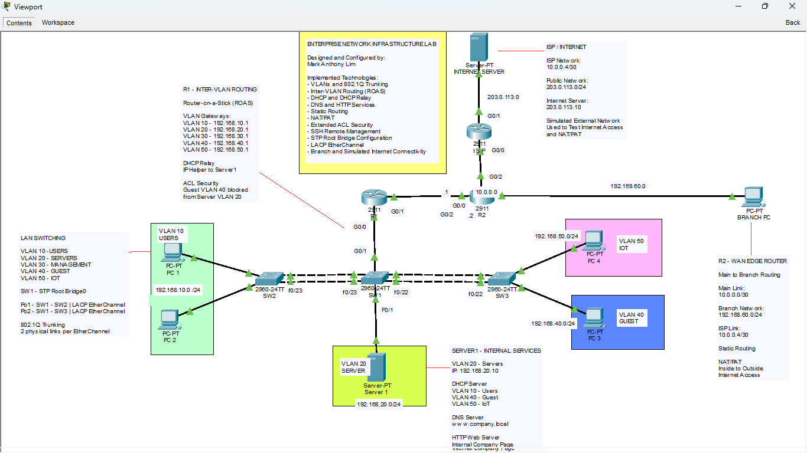
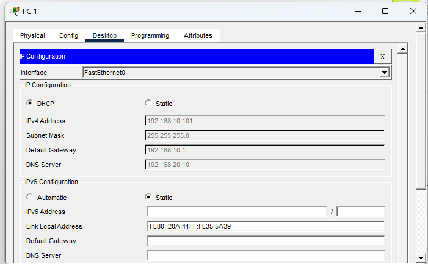
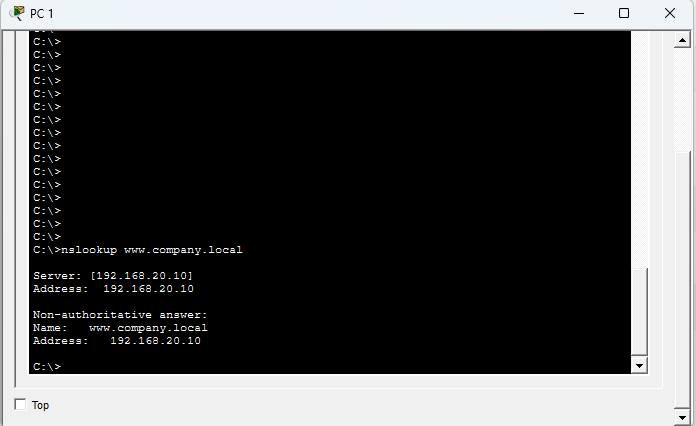
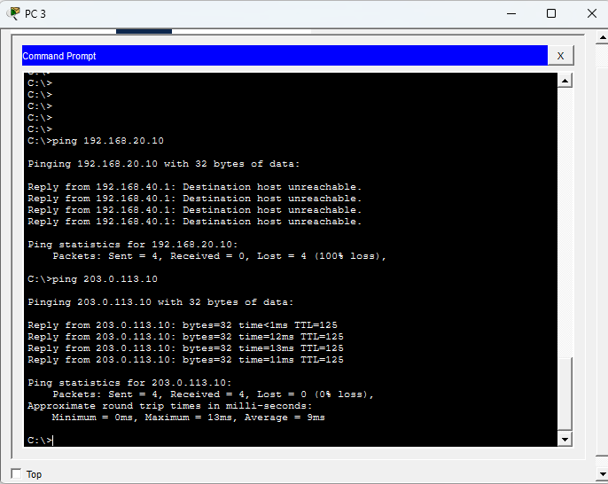
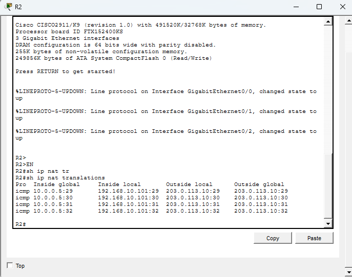
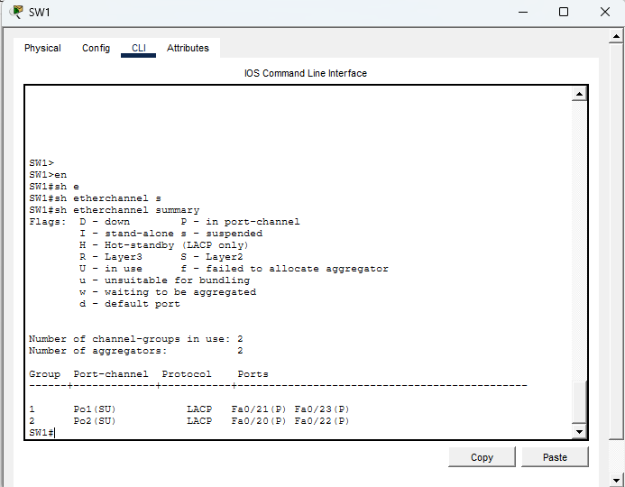
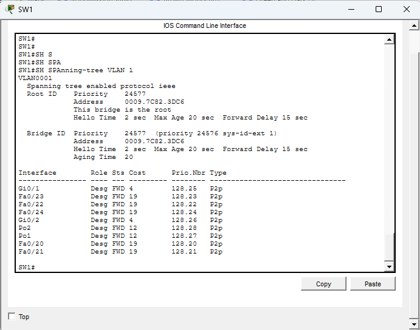

# Enterprise Network Infrastructure Lab

This is a small enterprise network I designed and built in **Cisco Packet Tracer** as a hands-on project while studying networking and preparing for the CCNA.

Instead of creating separate labs for every topic, I wanted to put what I've learned into one working network. The project includes a main office, a branch network, internal network services, security controls, redundant switch links, and a simulated Internet connection.

## Network Topology

The network is divided into multiple VLANs for users, servers, management, guests, and IoT devices.

The main office connects to a branch network through two routers, while a separate ISP router and public server are used to simulate Internet connectivity.

## What I Implemented

- VLAN segmentation
- 802.1Q trunking
- Router-on-a-Stick (ROAS)
- Inter-VLAN routing
- DHCP
- DHCP Relay using `ip helper-address`
- DNS
- Internal HTTP server
- Static routing
- NAT/PAT
- Extended ACLs
- SSH remote management
- Spanning Tree Protocol (STP)
- LACP EtherChannel
- Branch network connectivity
- Simulated ISP/Internet connectivity

## VLAN Design

| VLAN | Purpose | Network | Gateway |
|---|---|---|---|
| 10 | Users | 192.168.10.0/24 | 192.168.10.1 |
| 20 | Servers | 192.168.20.0/24 | 192.168.20.1 |
| 30 | Management | 192.168.30.0/24 | 192.168.30.1 |
| 40 | Guest | 192.168.40.0/24 | 192.168.40.1 |
| 50 | IoT | 192.168.50.0/24 | 192.168.50.1 |

Other networks used in the lab:

| Connection | Network |
|---|---|
| Main Office - Branch | 10.0.0.0/30 |
| Branch LAN | 192.168.60.0/24 |
| R2 - ISP | 10.0.0.4/30 |
| Simulated Internet | 203.0.113.0/24 |

## How the Network Works

**R1** handles inter-VLAN routing for the main office using Router-on-a-Stick. It also relays DHCP requests from the client VLANs to the centralized server.

**R2** connects the main office to the branch network and the simulated ISP. I configured static routes between the networks and PAT on R2 so internal devices can reach the simulated Internet.

**SW1** acts as the central switch and STP root bridge. I used LACP EtherChannel between the switches so multiple physical links operate as a single logical connection.

**Server1** uses the static address `192.168.20.10` and provides DHCP, DNS, and HTTP services for the network.

## Security

I wanted the Guest VLAN to have Internet access without being able to access the internal server network.

I configured an extended ACL on R1 that blocks traffic from VLAN 40 (Guest) to VLAN 20 (Servers), while allowing the Guest network to reach the simulated Internet.

I also configured SSH on the routers and switches for remote CLI management.

## Testing the Network

I tested each major part of the network after configuring it instead of assuming the configuration was working.

### DHCP

Clients in the appropriate VLANs receive their IP address, default gateway, and DNS server automatically.

### DNS

The internal DNS server resolves:

`www.company.local` → `192.168.20.10`

### Guest Network Isolation

A device in the Guest VLAN cannot reach the internal server, but it can still reach the simulated Internet.

### NAT/PAT

Internal private addresses are translated to the outside interface of R2 when accessing the simulated Internet.

### EtherChannel

I configured two LACP EtherChannels between the central switch and the access switches.

### Spanning Tree

SW1 is configured as the STP root bridge for a predictable Layer 2 topology.

## Packet Tracer File

The working network is included in this repository as a Cisco Packet Tracer Activity (`enterprise network by mark lim.pka`).

The activity is intended for viewing and testing the network. Selected topology and configuration options have been restricted, while CLI access is available so the device configurations and `show` commands can be inspected.

My original `.pkt` development file is kept separately as the master copy.

## What I Learned

This project helped me connect topics that initially felt separate when I was studying them individually.

For example, I had to think about how VLANs, trunking, Router-on-a-Stick, DHCP relay, routing, ACLs, NAT, STP, and EtherChannel affect each other when they are all part of the same network.

It also gave me more practice troubleshooting configurations instead of simply following a lab step-by-step.

## Next Steps

I'm continuing to develop the lab as I progress through my CCNA studies. Some features I plan to add later include:

- OSPF
- More redundancy
- Additional security policies
- More troubleshooting scenarios

## Author

**Mark Anthony Lim**

Computer Engineering graduate building hands-on experience in networking, IT infrastructure, and technical support.
